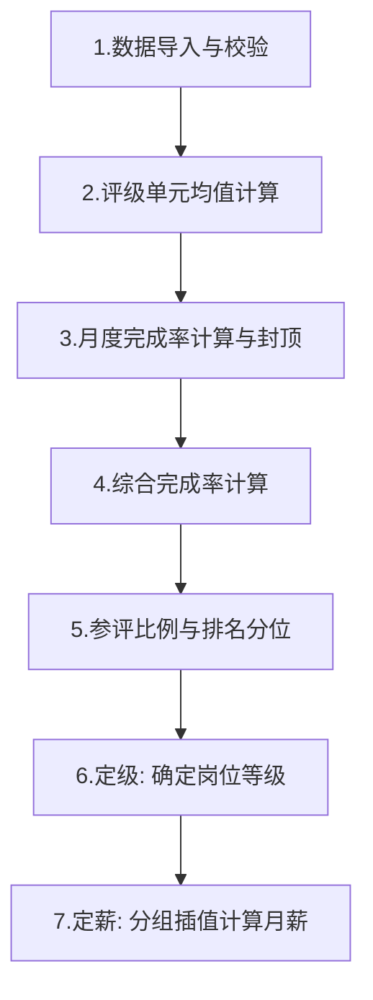
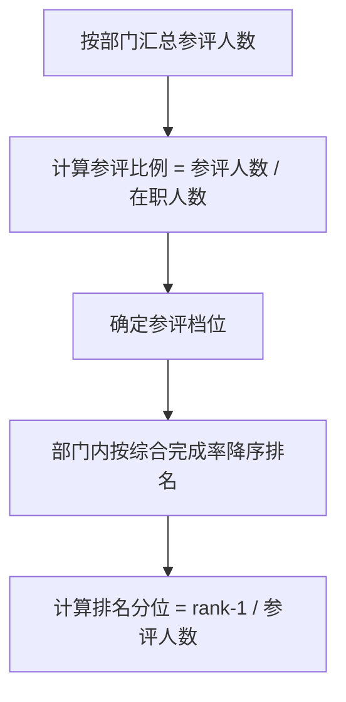
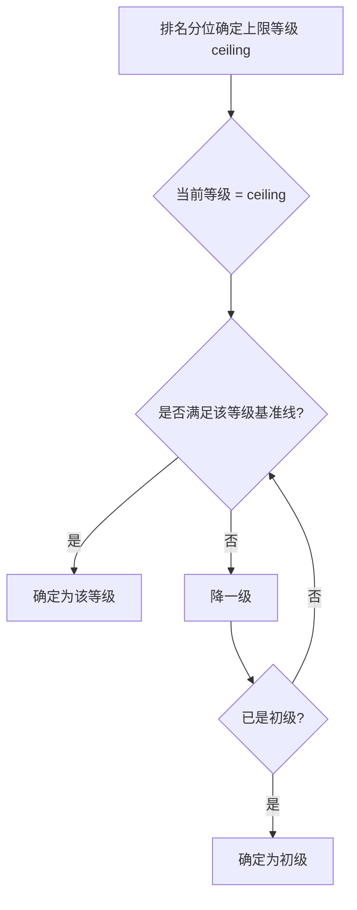
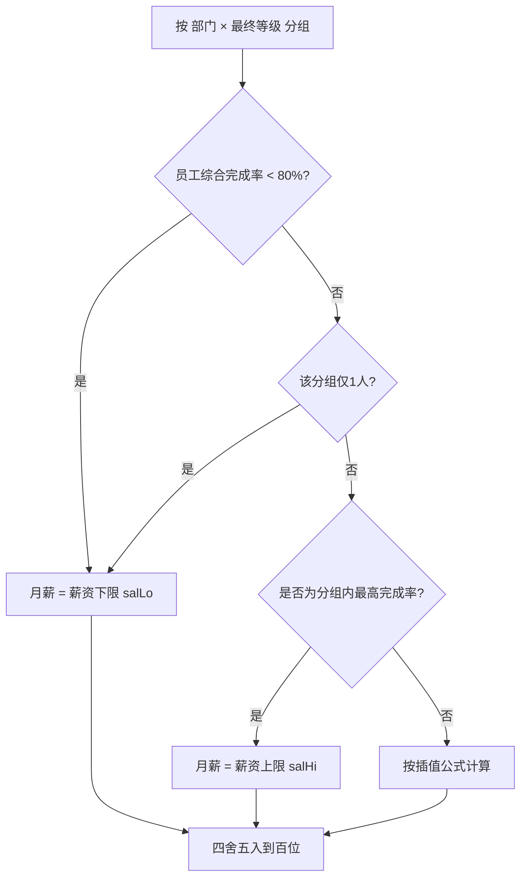

# 客服岗位薪资计算逻辑说明

## 一、整体流程概览



---

## 二、各步骤详细说明

### 步骤 1：数据导入与校验

- 导入 Excel 包含 3 个月的指标数据（指标1、指标2、接待量）
- 百分比指标（如转化率、客户满意度）以小数形式录入（如 `0.46` 表示 46%），系统自动 ×100
- **完整性判定**：指标1 和 指标2 均需 3 个月数据完整才能参与评级（`complete=true`）
- **接待量缺月容错**：接待量可缺月，不影响是否参评，仅有数据月份参与均值计算

### 步骤 2：评级单元均值计算

- **评级单元** = 部门 × 组别（如"天猫 / 标准服务组"）
- 对每个评级单元，逐月计算各指标的均值（所有该单元员工有数据月份参与）
- 均值用于后续计算员工个人完成率

### 步骤 3：月度完成率计算

| 指标类型 | 计算公式 |
|---------|---------|
| 正向指标（如客户满意度） | `完成率 = 个人值 / 单元均值` |
| 反向指标（如响应时间） | `完成率 = 2 - (个人值 / 单元均值)` |

**120% 封顶规则**：单月单项完成率超过 120% 时，按 120% 封顶。封顶发生在月度层面。

### 步骤 4：综合完成率计算

```
季度指标完成率 = 3 个月完成率的算术平均值（封顶后）
综合完成率 = 指标1季度完成率 × 权重1 + 指标2季度完成率 × 权重2
```

权重由岗位组别配置决定（如电商四部：客户满意度 40% + 转化率 60%）。

### 步骤 5：参评比例与排名分位



**参评档位**（影响各级别的分位阈值）：

| 参评比例 | 专家阈值 | 资深阈值 | 中级阈值 |
|---------|---------|---------|---------|
| > 80% | 3% | 5% | 25% |
| 60%~80% | 3% | 4% | 20% |
| 40%~60% | 2% | 3% | 15% |
| ≤ 40% | 2% | 2% | 10% |

**排名并列处理**：综合完成率相同时，按接待量季度均值降序；仍并列则取最差名次。

### 步骤 6：定级（确定岗位等级）



**各等级需满足的条件**：

| 等级 | 需满足条件 |
|------|-----------|
| 专家级 | 指标1基准线达标 + 指标2基准线达标 + 接待量达标 + 专家进阶标记 |
| 资深级 | 指标1基准线达标 + 指标2基准线达标 + 接待量达标 |
| 中级 | 指标1基准线达标 + 指标2基准线达标 + 接待量达标 |
| 初级 | 无门槛（兜底级别） |

> **接待量达标**：个人接待量季度均值 ≥ 单元接待量季度均值 × 80%

> **基准线**：正向指标需 ≥ 阈值（如客户满意度 ≥ 95），反向指标需 ≤ 阈值（如响应时间 ≤ 18秒）

### 步骤 7：定薪（分组插值计算月薪）

这是最核心的薪资确定环节，遵循以下优先级规则：



#### 定薪规则优先级（从高到低）

| 优先级 | 条件 | 结果 |
|--------|------|------|
| 1 | 综合完成率 < 80% | 月薪 = salLo |
| 2 | 该等级分组仅1人（或全组同完成率） | 月薪 = salLo |
| 3 | 综合完成率 ≥ 80% 且为全组最高 | 月薪 = salHi |
| 4 | 综合完成率 ≥ 80% 且排名居中 | 按插值公式计算 |

#### 线性插值公式

```
effectiveMinRate = max(0.8, 分组内实际最低完成率)

月薪 = salLo + (salHi - salLo) × (个人完成率 - effectiveMinRate) / (maxRate - effectiveMinRate)

最终月薪 = 四舍五入到百位(月薪)
```

**关键规则：插值区间下限锁定为 80%**

当分组内存在综合完成率 < 80% 的员工时，插值计算的完成率区间下限强制设为 80%（而非实际最低完成率）。这意味着：
- < 80% 的员工直接取 salLo
- ≥ 80% 的中间员工按 [80%, 分组最高完成率] 做线性插值

#### 定薪举例

某部门中级岗位有 A、B、C、D 四人，薪资区间 salLo=4200, salHi=4600：

| 员工 | 综合完成率 | 适用规则 | 计算过程 | 月薪 |
|------|-----------|---------|---------|------|
| A | 75% | 规则1: <80% | 直接取 salLo | 4200 |
| B | 82% | 规则4: 插值 | 4200 + 400×(82%-80%)/(94%-80%) = 4257 → 取百 | 4300 |
| C | 90% | 规则4: 插值 | 4200 + 400×(90%-80%)/(94%-80%) = 4486 → 取百 | 4500 |
| D | 94% | 规则3: 最高 | 直接取 salHi | 4600 |

> 注：插值区间为 [80%, 94%]，因为分组内存在 A(75%) < 80%。

---

## 三、分组维度说明

| 阶段 | 分组维度 | 说明 |
|------|---------|------|
| 评级单元（均值计算） | 部门 × 组别 | 如"天猫 / 标准服务组" |
| 排名池 | 部门 | 如"天猫"（所有组别合并排名） |
| 定薪分组 | 部门 × 最终等级 | 如"天猫 × 中级" |

> **薪资区间来源**：每位员工使用各自组别配置的薪资区间（salLo/salHi）。同一定薪分组内不同组别的员工，薪资区间可能不同。

---

## 四、特殊处理规则

### 4.1 不参评员工（participate=false）

- 参与评级单元均值计算（作为样本）
- 不进入排名池
- 不定级、不定薪

### 4.2 数据不完整员工（complete=false）

- 指标1 或 指标2 不满 3 个月 → 仅作为均值样本
- 不参与排名/定级/定薪
- 接待量缺月不影响完整性判定

### 4.3 120% 封顶

- 封顶发生在月度层面（每月每项指标单独判断）
- 封顶后再取 3 月均值作为季度完成率
- 示例：某月完成率 150% → 封顶为 120%，其余月份正常计算

---

## 五、数据流转总览


